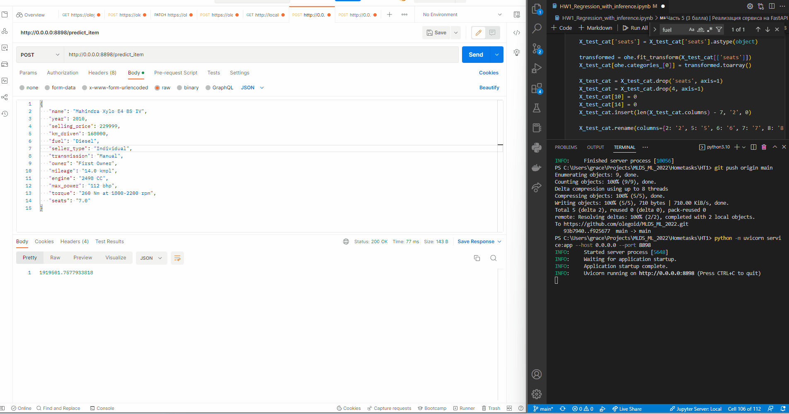

### Выводы:

В данной работе познакомился поближе с моделями линейной регрессии.

Данные были нормализованы и почищены перед обучением модели. Так же пропуски заполнены медианными значениями из тренировочного набора данных.

В качестве доп задания сделано разбиение столбца `torque` на `torque` и `max_torque_rpm`.

Чисто формально получились все пункты, но качество предсказаний оставляет желать лучшего. Изначальный скор 0.6 получилось улучшить добавлением категориальных признаков. Получилось 0.66. Возможно стоило бы исключить некоторые созависимые предикторы и добавить, например, `fuel`.

### Как работает сервис:

